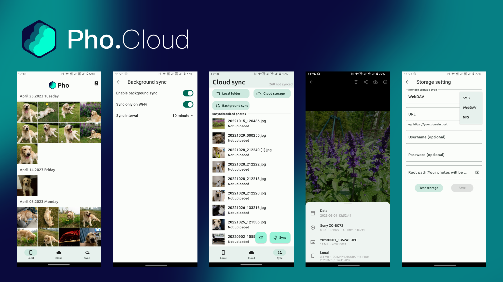

<br/><br/><p align="center">

</p>
<h3 align="center">
Pho - 一个用于查看和上传照片的无服务端应用
</h3>
<p align="center">
  
</p>
<p align="center">
  <a href="README.md">中文</a> | <a href="README_EN.md">English</a>
</p>

### 安装

**开源版**（仅 Android APK）：
- [下载 APK](https://github.com/fregie/pho/releases) — 仅含 SMB / WebDAV / NFS，无 Pro 功能

**Pro 版**（含全部功能，需付费）：
- [App Store](https://apps.apple.com/cn/app/pho-%E5%90%8C%E6%AD%A5%E7%85%A7%E7%89%87%E5%88%B0nas-%E7%BD%91%E7%9B%98/id6451428709) — iOS 版,支持 AES 加密、并行上传、筛选器、百度网盘等

> 开源仓库仅提供 APK 下载。iOS 用户请前往 App Store 下载 Pro 版（支持免费试用基础功能后购买 Pro）。

### 介绍
该应用的目的是替代手机上的自带相册应用,并且能够将照片同步到网络储存.  
功能简单,只是用于查看照片以及同步照片到网络储存.试图做到优秀的体验.

### 功能
* 本地照片查看
* 云端照片查看
* 增量同步照片到云端
* 后台定期同步
* 无数据库,无服务端
* 以时间组织云端存储的目录结构

### 支持的网络储存
- [x] Samba
- [x] Webdav
- [x] NFS
- [ ] 阿里网盘
- [ ] oneDrive
- [ ] google drive
- [ ] google photo

### 与 Pro 版本差异
本仓库为 Pho 开源版,仅包含核心的照片查看与同步功能.以下功能仅在 Pro 版本中提供(未开源):

- AES 加密上传(支持 AES-128-CFB 与 AES-256-GCM,加密视频支持 Range 播放)
- 并行上传调优(多文件并发上传)
- 文件筛选器(按类型/日期等条件过滤同步)
- 目录结构配置(可选 `YYYY/MM/DD` 或 `YYYYMMDD` 组织方式)
- 主题色自定义
- 百度网盘支持

开源版仅支持 Samba / WebDAV / NFS 三种网络储存.

Pro 版在 App Store 提供: [App Store](https://apps.apple.com/cn/app/id6451428709)

### Screenshots
<p align="left">

</p>

### roadmap
- [x] 支持放大/缩小图片
- [x] 支持上传/浏览视频
- [x] 支持NFS
- [x] 支持IOS端
- [ ] 支持desktop端
- [x] 支持中文

### 构建
#### 环境要求
- Flutter: 3.41.4 (stable), Dart: 3.11.1
- Go: 1.25 (toolchain go1.25.4)
- JDK: 17
- Android SDK: compileSdk 36
- Android NDK: 用于构建嵌入式 Go 服务端 (gomobile bind)
- protoc + 插件: protoc-gen-go@v1.27.1, protoc-gen-go-grpc@v1.1.0, protoc_plugin@21.1.2 (Dart)

#### 构建步骤
```bash
# 1. 生成 protobuf 代码 (Go + Dart stubs)
make prebuild      # 安装 protoc 插件
make protobuf

# 2. 构建嵌入式 Go 服务端
make server-aar     # Android: android/app/libs/server.aar (需 gomobile)
make server-ios     # iOS: ios/Frameworks/RUN.xcframework
make server-linux   # Linux: linux/lib/run.so
make server-windows # Windows: windows/lib/run.dll

# 3. 构建 Flutter 应用
make apk           # Android APK
make ipa           # iOS IPA

# 4. 运行测试 (需要 Docker 用于 SMB/WebDAV/NFS 测试容器)
make test
```

> 注: `flutter run` 不会自动构建 `android/app/libs/server.aar`,需先执行 `make server-aar`,否则 Go 服务端无法启动.

### Contribute
感谢各位的积极反馈

给本项目提需求的还不少,但是我一个人精力有限,如果你有兴趣,欢迎加入.

可以在issue中回复沟通,帮忙一起做一些功能,提出你的pull request.

### 文件储存逻辑
本着尽可能简单的逻辑来储存文件,以时间为目录结构,以文件名为文件名储存源文件.在根目录创建一个`.thumbnail`目录来储存生成的缩略图,缩略图的目录结构与源文件相同.  
你可以随时以其他形式利用你备份上去的照片,而不用依赖此app.
目录结构示意图:
```bash
├── 2022
│   ├── 07
│   │   ├── 02
│   │   │   ├── 20220702_100940.JPG
│   │   │   ├── 20220702_111416.JPG
│   │   │   └── 20220702_111508.JPG
│   │   └── 03
│   │       ├── 20220703_101923.DNG
│   │       ├── 20220703_112336.DNG
│   │       └── 20220703_112338.DNG
├── 2023
│   └── 01
│       └── 03
│           ├── 20230103_112348.JPG
│           ├── 20230103_124634.JPG
│           └── 20230103_124918.DNG
└── .thumbnail
     └── 2022
         └── 07
             ├── 02
             │   ├── 20220702_100940.JPG
             │   ├── 20220702_111416.JPG
             │   └── 20220702_111508.JPG
             └── 03
                 ├── 20220703_101923.DNG
                 ├── 20220703_112336.DNG
                 └── 20220703_112338.DNG
```


### Star History

[](https://star-history.com/#fregie/pho&Date)
